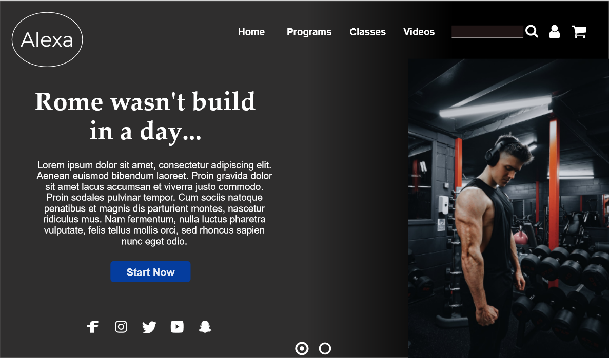

# UI Design Using Axure
This repository includes the UI design developed using Axure RP. Axure is used to create high-fidelity wireframes and interactive prototypes that showcase the user experience and functionality of the project.

## UI Design Overview
* Wireframes: The initial wireframes for the project are created to define the layout, user flow, and key screens.
* Interactive Prototypes: Axure allows us to build fully interactive prototypes that simulate the real-world behavior of the application. These prototypes help test usability, gather feedback, and refine the user experience.
* High-Fidelity Design: The UI design includes detailed visual components like buttons, navigation bars, forms, and other elements that represent the final look and feel of the application.

## Key UI Screens
* Homepage: Overview of the landing page, including navigation, key elements, and interactions.
* Dashboard: Design of the user dashboard with interactive widgets.

## How to View the Axure Design
To view or edit the Axure project file:
1. Clone the repository using Git:

```bash
  git clone <repository-url>
```
2. Open Axure RP (version X.X or above).
3. Open the .rp file from the cloned project folder.
4. Preview the design directly in Axure or publish to Axure Cloud for team collaboration.

## Technologies Used
* Axure RP for wireframing and prototyping
* Git for version control

## Screenshots


---



## License
This project is licensed under the MIT License , see the LICENSE file for details.
